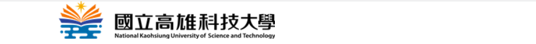

# code
# xinyi1201 鄒欣誼
## xinyi1201 鄒欣誼
### xinyi1201 鄒欣誼
#### xinyi1201 鄒欣誼
##### xinyi1201 鄒欣誼


😄 🚴
______



- [ ] to do list
- [X] 1st thing
- [ ] 2nd thing
- [ ] 3rd thing
- [ ] 4th thing

 ```python
s = " python highlighted syntex "
print(s)
```
```js
var s = "javascript highlighted";
alert(s)
```

### Colons can be used to align columns.

|      Tables   |      Are      |  cool |
|:-------------:|:-------------:| -----:|
|    col3 is    | Right-aligned | $1600 |
|    col2 is    |   centered    |   $12 |
| zebra stripes |    areneat    |    $1 |

---
<p>There must be at least 3 dashes separating each header cell.
The outer pipes () are optional, and you don't need to make the
raw Markdown line up prettily. You can also use inline Markdown.</p>

| Markdown |   Less   |     Pretty |
|:--------|:--------:| ----------:|
| *Still*  | `rander` | **Nicely** |
|    1     |    2     |          3 |
